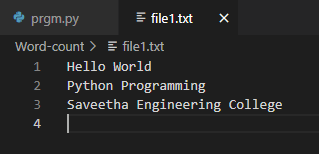
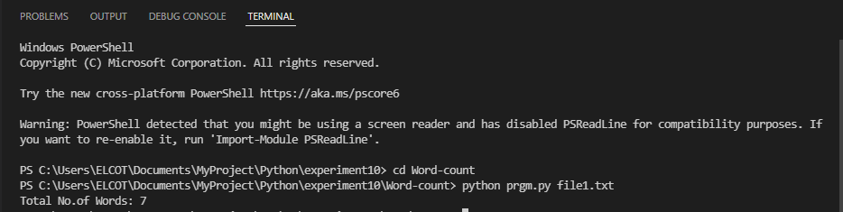

# command-line-arguments-to-count-word
## AIM:
To write a python program for getting the word count from the contents of a file using command line arguments.
## EQUIPEMENT'S REQUIRED: 
PC
Anaconda - Python 3.7
## ALGORITHM: 
### Step 1:
Import sys module to use command line arguments.

### Step 2:
Use the open() by getting the file name with "sys.argv[1]" which means the first index of given argument

### Step 3:
Iterate the content of the file using for loop.

### Step 4:
Split the contents into each line using .split() function.

### Step 5:
Iterate the list of lines and increment the value of variable (word) each time.

### Step 6:
Run the program by giving "python prgm.py EX12.txt" on the terminal.

### Step 7:
End of the Program.

## PROGRAM:
```
#Program to count the no.of lines in a file using command line arguments.
#Developed by: Paul Andrew D
#RegisterNumber: 21500230

import sys
fp=open(sys.argv[1])

with open("file1.txt","r") as fp:
    words = 0
    for data in fp:
        lines=data.split()
        for line in lines:
            words += 1
    print("Total No.of Words:",words)
```

## OUTPUT:
### file.txt:


### Command Powershell Prompt:



## RESULT:
Thus the program is written to find the word count from the contents of a file using command line arguments.
